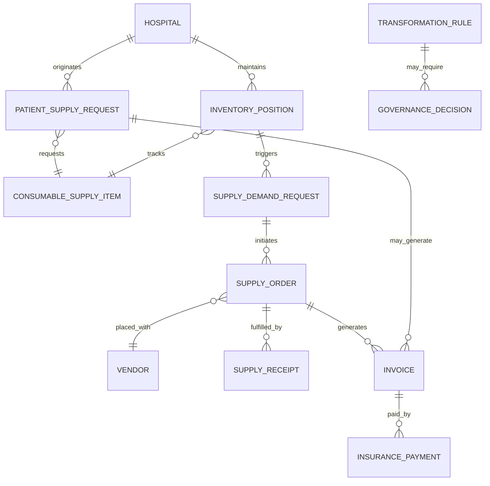

# DIV-1 Conceptual Data Model Draft

Status: draft pending readable data dictionary.

Sources:

- `workflow-diagram-visual-notes`
- `src-rfp-relevant-matches`

## Conceptual Entities

| Entity | Description |
| --- | --- |
| Hospital | One of the 10 fictional hospital sources. |
| Patient Supply Request | Demand signal for a consumable supply needed for patient care. |
| Consumable Supply Item | The supply item that must be cleaned, normalized, and consolidated into the item master. |
| Inventory Position | On-hand quantity and reorder condition for an item at a hospital. |
| Supply Demand Request | Request to obtain supply when inventory is unavailable or reorder conditions are met. |
| Purchase / Supply Order | Financial/ordering action to acquire supply. |
| Supply Receipt | Receipt of ordered supply into inventory. |
| Vendor | Supplier associated with consumable supply items and orders. |
| Invoice | Financial record associated with ordered supply or patient insurance. |
| Insurance Payment | Payment event after patient insurance invoicing. |
| Transformation Rule | Business rule used to clean, normalize, map, or flag data. |
| Governance Decision | Human-in-the-loop decision for ambiguous data conditions. |

## Relationships

## Dataset Binding Needed

The readable workbook/data dictionary should confirm:

- actual field names
- entity keys
- relationship cardinality
- whether patient-level fields exist or are abstracted
- whether invoice/order/payment fields are present in the dataset or only in the workflow diagram

