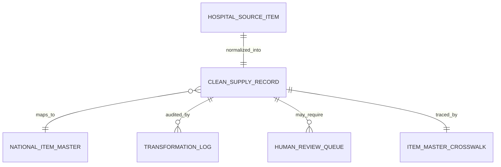

# DIV-2 Logical Data Model Draft

Status: draft from readable workbook and generated outputs.

Sources:

- `raw/Excel-data.xlsx`
- `deliverables/Quoter_Tech1a_cleanfile.csv`
- `deliverables/Quoter_Tech1a_itemmaster.csv`
- `work/column_dictionary.csv`

## Logical Tables

| Logical Table | Purpose | Source / Output |
| --- | --- | --- |
| `hospital_source_item` | Raw item-level record from one of the 10 source hospitals. | `raw/Excel-data.xlsx`, sheet `Hosptual A-J` |
| `clean_supply_record` | Cleaned row-level supply-chain record preserving SBRN traceability. | `Quoter_Tech1a_cleanfile.csv` |
| `national_item_master` | Consolidated national-level consumable item record. | `Quoter_Tech1a_itemmaster.csv` |
| `item_master_crosswalk` | Mapping from source SBRN and hospital item number to canonical national item. | `work/item_master_crosswalk.csv` |
| `transformation_log` | Field-level audit of before/after standardization changes. | `work/transformation_log.csv` |
| `human_review_queue` | Data-governance issues requiring SME review. | `work/human_review_queue.csv` |

## `clean_supply_record`

Primary key: `SBRN`

| Field | Description |
| --- | --- |
| `SBRN` | Source-stable record identifier; preserved unchanged. |
| `Hospital` | Hospital A-J source identifier. |
| `FieldItemMasterNumber` | Internal hospital item-master reference. |
| `Part Name` | Canonicalized supply item name. |
| `Part Description` | Normalized item description. |
| `Unit of Measure` | Standardized unit code: `BOX`, `EA`, `UNIT`, `BAG`, or `PACK`. |
| `Classification` | Item classification from source. |
| `Manufacturer Name` | Canonicalized manufacturer family. |
| `Vendor Name` | Canonicalized vendor name. |
| `Vendor Contact Info` | Numeric vendor contact/reference value. |
| `Vendor Part Number` | Vendor item code. |
| `Catalog Number` | Catalog reference. |
| `Price` | Numeric unit price. |
| `Lot Number` | Lot traceability identifier. |
| `Batch Number` | Batch traceability identifier. |
| `Expiration Date` | ISO formatted expiration date. |
| `Recall Status` | Normalized recall status where deterministic. `Monitoring` remains governance flagged. |
| `Purchase Order Number` | PO identifier. |
| `Purchase Date` | ISO formatted purchase date. |
| `Order Status` | Normalized order status: `Pending`, `Delivered`, `Shipped`, or `Canceled`. |
| `QtyOnOrder` | Integer quantity ordered. |
| `OnHandQty` | Integer on-hand quantity. |
| `Location` | Hospital storage location. |
| `NationalItemMasterId` | Canonical item-master identifier. |
| `DataQualityFlags` | Semicolon-delimited quality/governance flags. |
| `HumanReviewRequired` | Boolean indicator for SME/governance queue routing. |

## `national_item_master`

Primary key: `NationalItemMasterId`

| Field | Description |
| --- | --- |
| `NationalItemMasterId` | Canonical national item identifier derived from normalized part name. |
| `CanonicalPartName` | Standardized consumable item name. |
| `CanonicalDescription` | Representative item description. |
| `UnitOfMeasure` | Representative normalized unit of measure. |
| `Classification` | Representative classification. |
| `Manufacturers` | Distinct canonical manufacturers observed for the item. |
| `Vendors` | Distinct canonical vendors observed for the item. |
| `HospitalCount` | Count of hospitals where the item appears. |
| `SourceRecordCount` | Number of source records mapped to the item. |
| `MinPrice` | Minimum observed price. |
| `MedianPrice` | Median observed price. |
| `MaxPrice` | Maximum observed price. |
| `TotalOnHandQty` | Total on-hand quantity across records. |
| `TotalQtyOnOrder` | Total quantity on order across records. |
| `HumanReviewRecordCount` | Number of mapped records carrying human-review flags. |

## Relationships

## Current Output Metrics

- `clean_supply_record`: 5,000 rows.
- `national_item_master`: 10 rows.
- `transformation_log`: 24,886 field-level entries.
- `human_review_queue`: 3,549 records.
- Duplicate `SBRN` count after cleaning: 0.

