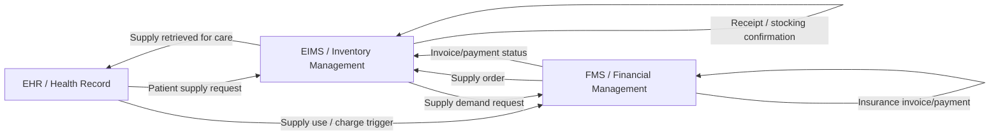

# SV-2 Systems Resource Flow Description Draft

Status: supporting design note; superseded by the final SV-2 in `deliverables/Quoter_Tech1a_diagrams.*`.

Sources:

- `workflow-diagram-visual-notes`
- `src-rfp-relevant-matches`

## Systems / Resource Nodes

| Node | Role In Workflow | Factory Interpretation |
| --- | --- | --- |
| EHR / Health Record | Originates patient supply request and records supply use for patient care. | Clinical demand and care-context source. |
| EIMS / Inventory Management | Checks on-hand inventory, retrieves supply, sends demand request, receives supply, stocks inventory, monitors reorder point. | Operational supply-chain system of record for item availability and movement. |
| FMS / Financial Management | Orders supply, pays invoices, invoices patient insurance, receives insurance payment. | Financial transaction and payment system. |

## Resource Flow Draft

## Dataset Binding Used In Final Diagram

The final diagram binds resource flows to these fields in the readable dataset and cleaned output:

- hospital identifier
- supply/item identifier
- item description
- vendor
- inventory quantity
- reorder point
- order/request identifiers
- order/receive dates
- invoice/payment fields
- insurance/payment indicators

## Review Notes

- The final SV-2 should not overclaim VA-specific architecture because the RFP says the workflow and dataset are fictional and system agnostic.
- The final diagram should show the data/resource movement needed to explain the cleaned dataset and item master.
